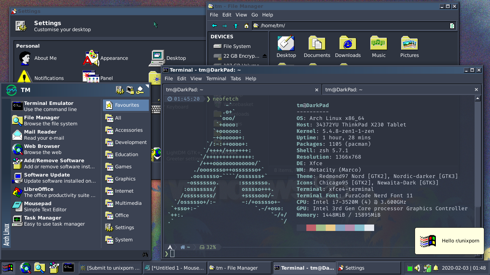

# This is a fork of original theme builder with Nord theme preconfigured
Original repo: https://github.com/matthewmx86/Redmond97/tree/master/Extras/Theme_Builder

Reddit post: https://www.reddit.com/r/unixporn/comments/exyl72/xfce_make_it_classic_make_it_dark/

## Preview

Redmond97 theme generator script.
Use the config file to choose your colors and other options. When the theme is installed it will save your config file in the installed
theme folder for later reference.

To use the script:
- Run ./gen_theme.sh to compile and install the theme.

Files are installed in ~/.themes/
